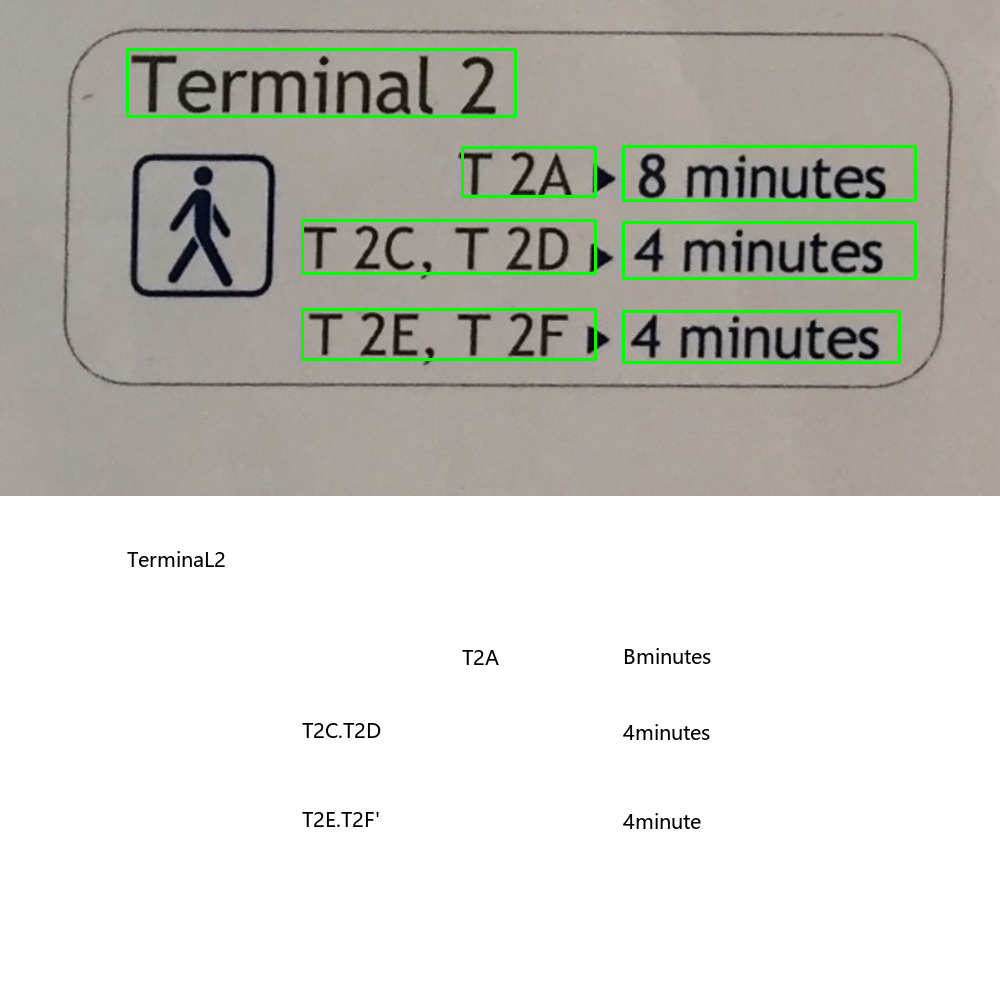
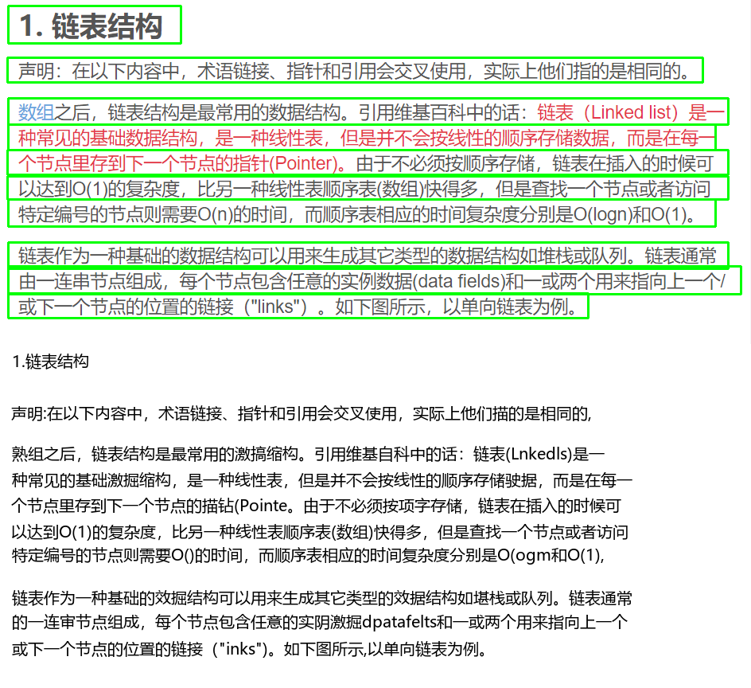

# CTPN + CRNN  Pytorch Chinese OCR

Chinese characters recognition repository based on CTPN， CRNN


## Performance

recognize Chinese Characters from image, here shows some results

<p align='center'>
</img>
</p>
<p align='center'>
</img>
</p>

## Environments

1. WIN 10 or Ubuntu 16.04
2. **PyTorch 1.2.0 (may fix ctc loss)** with cuda 10.0，**recommend 1.6.0**
3. yaml
4. easydict
5. tensorboardX
6. opencv
7. pillow
8. numpy

##  How to use?

```
[run] python ctpn_crnn.py --image_path images/test_1.png (or change to your image path)
```

after run above, you could fine result from folder

```
output/result/result_0.png (or result_1.png depending on how many image you had run)
```


## File instructions

- crnn  (folder)
  - include all  CRNN scripts
- ctpn_pytorch (folder)
  - include all CTPN scripts
- font (folder)
  - include some fonts support Chinese
- images (folder)
  - include some test images
- output (folder)
  - chechkpoints (folder)
    - include CRNN checkpoint
  - result (folder)
    - include test output

## How to train & Data set 

1. Data set for **CRNN** training

   - 3.6 Million Synthetic Chinese String，download from [here](https://pan.baidu.com/s/1ErLFLUf8IFTDnzxAs8parA ) , (password: auwl)

2. Edit **lib/config/360cc_config.yaml DATA:ROOT**  to your image path

   - ```
     DATASET:360CC
     ROOT: "your image path"
     ```

3. Download [labels](https://pan.baidu.com/s/11rUYMON7FqI8u-dAIjARyw) (password: fwup)

4. Put *char_std_5990.txt* in **lib/dataset/txt/**

5. And put *train.txt* and *test.txt* in **lib/dataset/txt/**

   eg. test.txt

   ```
   20456343_4045240981.jpg 89 201 241 178 19 94 19 22 26 656
   20457281_3395886438.jpg 120 1061 2 376 78 249 272 272 120 1061
   ......
   ```

   